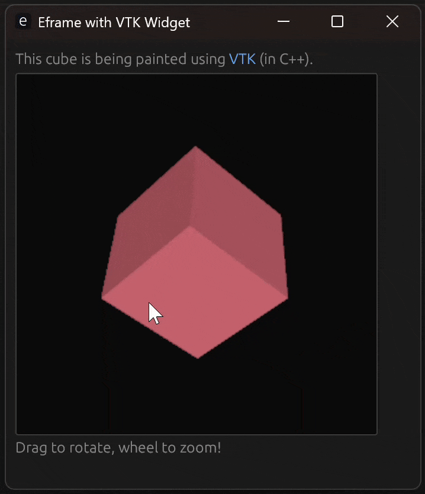

# VTK egui/eframe demo

This simple demo illustrates how to use https://vtk.org/ (and C++) to build interactive 3D widgets for use in https://github.com/emilk/egui Rust application.

  

I was not able to get this working while linking to VTK dynamically so I had to resort to linking it statically. This means that it is much easier to link the final application binary from the C++ side (since otherwise we need to manually instruct rustc to link to all the individual VTK modules which would be very painful and error prone...).

An unfortunate side-effect of doing final linking on the C++ side is that we currently have to then manually define all the eframe linker depencies on the C++ side. Currently this has only been done for Windows but it should not be hard to adapt the CMake file to support other platforms too. Once https://github.com/corrosion-rs/corrosion/issues/335 is resolved, this should hopefully not be an issue anymore.

To get started, you should follow https://docs.vtk.org/en/latest/build_instructions/build.html to build and install VTK on your system. Remember to build with the `-DBUILD_SHARED_LIBS=OFF` flag to make sure it gets build as a static library. Also make sure to install VTK in a known directory since you will need that later. Below is an example for how this can be done (inside the VTK source dir and using the "x64 Native Tools Command Prompt for VS 2022"):

    mkdir build
    cd build
    cmake -GNinja .. -DBUILD_SHARED_LIBS=OFF
    cmake --build . --config Release
    cmake --install . --prefix C:\Users\gerha\Projects\vtk-msvc-static

You can then change to the source dir for this project and build it as follows:

    mkdir build
    cd build
    cmake -GNinja -DVTK_DIR=C:\\Users\\gerha\\Projects\\vtk-msvc-static\\lib\\cmake\\vtk-9.5 ..
    cmake --build .

If you are using vscode, you can also update `.vscode/settings.json` to update VTK_DIR to the directory where you installed VTK on your own system.

Unfortunately I don't currently have time to implement feature requests, fix bugs, help out with compiler issues etc. but please feel free to sumbit PRs if you want to help improve this integration!

## TODO list:

- [ ] Get resize working for the VTK widget
- [ ] Refactor the C++ code to encapsulate state in a class rather than just having it "floating"
- [ ] Abstract the VTK+eframe integration into a base class that custom widgets can inherit from
- [ ] Figure out how to handle HiDPI rendering properly for VTK widgets
- [ ] Add Linux support
- [ ] Add Mac support
- [ ] Add WebGPU support
